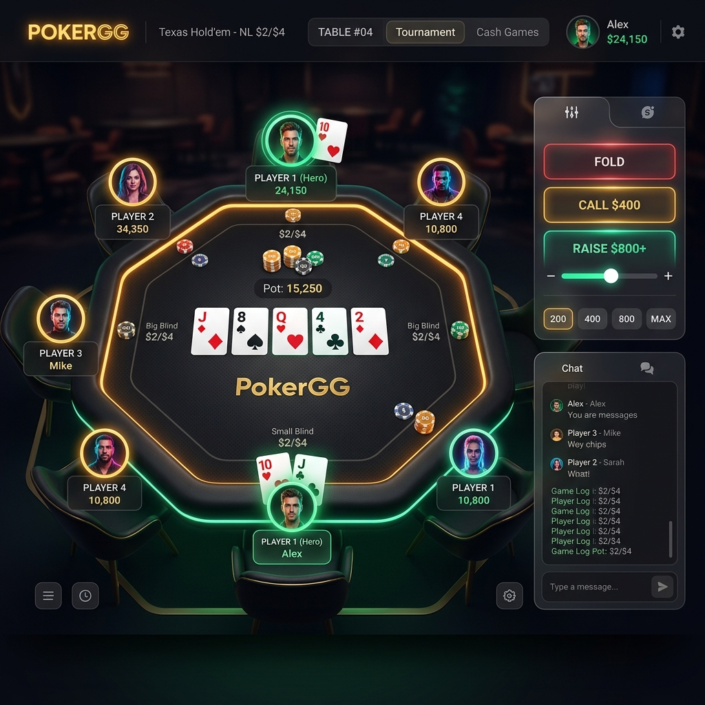
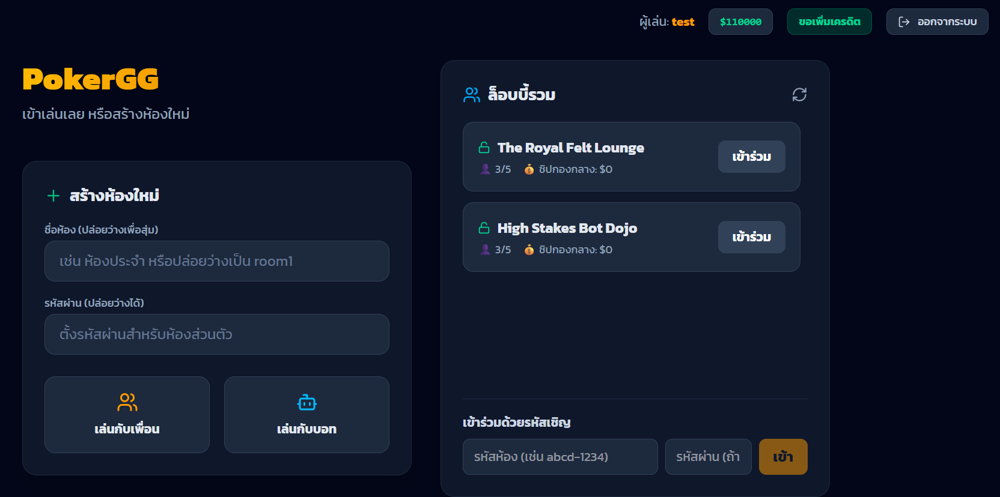

# 🃏 PokerGG (Web Game)

**PokerGG** is a fully functional, modern web-based Texas Hold'em poker game. Built with cutting-edge web technologies, it features real-time multiplayer capabilities, intelligent offline bots, and a sleek, glassmorphic UI.

## ✨ Features

- **♠️ Texas Hold'em Engine**: Complete poker logic including Hand Evaluation (High Card to Royal Flush), Betting Rules (Call, Raise, Fold, All-In), and Pot Management.
- **🔒 Firebase Integration**: Persistent user data tracking! Chips and Hand Histories are permanently saved on Firebase Firestore.
- **🤖 Smart Bots**: Play offline against AI bots. You can add or remove bots dynamically during a game.
- **🏠 Room Management**: Create private rooms with passwords or public rooms for friends to join. Dynamic lobby system included.
- **🎨 Modern UI/UX**: Designed with a dark mode aesthetic, smooth animations (Framer Motion), and responsive layout that works on desktop and mobile.

## 🛠️ Tech Stack

- **Frontend**: React 18, TypeScript, Tailwind CSS, Lucide Icons, Framer Motion
- **Backend / Game Engine**: Node.js, Express, Socket simulation via Polling
- **Database**: Firebase Admin SDK (Firestore)
- **Build Tool**: Vite & ESBuild

## 🚀 Getting Started

### Prerequisites

Make sure you have [Node.js](https://nodejs.org/) installed on your machine.

### Installation

1. Clone the repository:
   \\\ash
   git clone https://github.com/mamanamay/poker-gg.git
   cd poker-gg
   \\\

2. Install dependencies:
   \\\ash
   npm install
   \\\

3. Configure Firebase:
   - Make sure your \irebase-service-account.json\ is placed in the root directory.

4. Start the Development Server:
   \\\ash
   npm run dev
   \\\

5. Build for Production:
   \\\ash
   npm run build
   npm start
   \\\

## 🎮 How to Play

1. **Register/Login**: Enter a Username and Display Name to start. New users receive a default amount of chips.
2. **Join or Create a Room**: From the Lobby, you can join existing rooms or create your own (with optional passwords).
3. **Add Bots**: If you're alone, you can add up to 4 bots to play against.
4. **Action**: Wait for your turn to act. You can Fold, Check, Call, or Raise. Your hand's win probability is dynamically calculated to assist you!

## 📜 License
This project is for educational and entertainment purposes.
